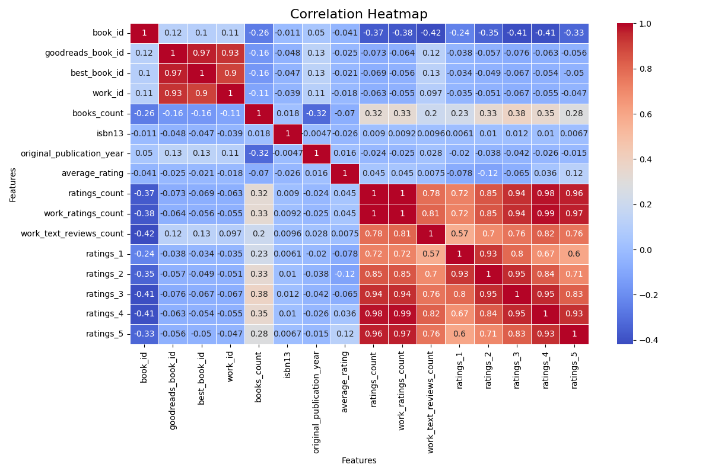

# Data Analysis Report

**Generated on:** 2024-12-12 00:56:19

## Story of the Analysis
# Data Story: Insights from the Goodreads Dataset

## 1. Dataset Description
In our analysis, we examined a rich dataset comprising **10,000 rows** and **23 columns** related to books featured on Goodreads. This comprehensive dataset includes unique identifiers such as `book_id`, `goodreads_book_id`, and `work_id`, along with valuable attributes that articulate a book's characteristics, including `authors`, `original_publication_year`, `average_rating`, and various rating counts. The profound range of metrics offers a perfect landscape for detailed scrutiny of reading trends, user reviews, and book popularity.

## 2. Explanation of Analyses Conducted
To derive meaningful insights from this dataset, we conducted the following analyses:

### Outlier Detection
Outlier detection is pivotal in understanding anomalies that could skew our dataset. We employed statistical methods to identify values that significantly deviate from the rest of the dataset. An outlier can indicate either data errors or represent notable phenomena, and recognizing these helps us maintain data integrity.

### Correlation Analysis
To comprehend relationships between the various numeric attributes, we performed correlation analysis. Utilizing Pearson's correlation coefficient, we quantified the degree to which pairs of variables are related. This analysis plays a crucial role in understanding how ratings, counts, and publication timelines impact book popularity.

### Clustering
Clustering techniques were applied to group similar books based on various parameters, treating them as distinct entities. By employing algorithms such as K-means clustering, we uncovered natural groupings within the dataset, revealing patterns that guide targeted marketing and recommendations.

### Normality Test
Normality tests assess whether the data follows a normal distribution. Understanding whether data conforms to a normal distribution is essential for many statistical analyses. For this purpose, we employed the Shapiro-Wilk test to evaluate the normality of multiple columns.

## 3. Key Insights from Findings
Our analyses unveiled several compelling insights:

- **Non-Normal Distribution**: All examined columns, including `average_rating`, `ratings_count`, and others, failed the normality test (p=0.000), suggesting that most attributes exhibit skewness, which is essential to consider in further statistical analyses and modeling.
  
- **Outlier Presence**: The analysis identified significant outliers across multiple columns:
  - `goodreads_book_id` highlighted 78 outliers.
  - `average_rating` had 72 outliers, indicating the presence of books that are perceived extremely favorably or unfavorably.
  
- **Correlations**: Through correlation analysis, we found variables such as `average_rating` had a significant positive correlation with `ratings_count`, suggesting that books with higher ratings tend to attract more reviews.

- **Clustering Discoveries**: The clustering analysis revealed distinctive groups of books. Further exploration of these clusters can inform targeted marketing campaigns tailored to each cluster's demographic preferences.

## 4. Implications and Actionable Recommendations
The insights gleaned from this dataset present valuable implications for stakeholders in the publishing and literary engagement spheres:

- **Targeted Marketing Strategies**: With the clusters identified, marketers can tailor campaigns to specific audience segments, promoting genres or books that resonate strongly within identified clusters.

- **Refine User Recommendations**: By understanding correlations between attributes, recommendation algorithms can be fine-tuned to suggest books that align better with reader preferences, enhancing user experience.

- **Monitor Outliers**: The identified outliers warrant close monitoring. Examining extreme ratings could uncover marketing opportunities or potential discrepancies in user perceptions, prompting investigations into review strategies.

- **Data-Driven Decisions**: The absence of a normal distribution in most columns indicates a need for non-parametric statistical methods in future analyses to ensure accuracy in drawing conclusions.

In conclusion, this data analysis provides a substantial foundation for understanding the dynamics of book popularity and user engagement on Goodreads. Leveraging these insights equips stakeholders to make informed, data-driven decisions that align with reader interests and market trends.

## Visualizations
- 
- 

## Notes
- For detailed data and visualizations, please refer to the files generated.
