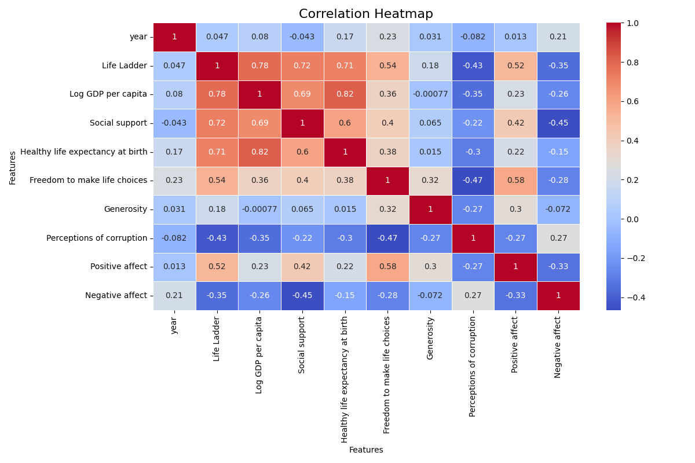
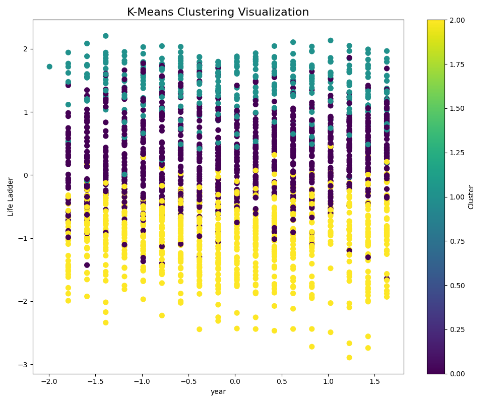

# Data Analysis Report

**Generated on:** 2024-12-12 01:00:00

## Story of the Analysis
### Data Story: Understanding the World Through Happiness and Well-Being Metrics

#### 1. Description of the Dataset

In our quest to understand the intricate relationships between various socio-economic factors and the overall well-being of countries worldwide, we conducted an analysis using a comprehensive dataset consisting of 2,363 rows and 11 columns. The dataset encapsulates key indicators such as 'Life Ladder', which signifies subjective well-being; 'Log GDP per capita', indicative of economic performance; and 'Social support', reflecting community and societal engagement, among other factors. Each entry is tied to a specific country and year, allowing for temporal and geographical comparisons in assessing happiness and quality of life across the globe.

#### 2. Explanation of the Analyses

To derive meaningful insights from this dataset, we performed several analytical methods, each designed to peel back the layers of complexity inherent in the interactions among the variables:

- **Outlier Detection:** We systematically examined the dataset for anomalies that deviate significantly from other observations. This step was crucial in ensuring that our findings remained robust and not skewed by erratic data points. 

- **Correlation Analysis:** We evaluated the relationships between the various metrics to determine how closely they are connected. This analysis utilized correlation coefficients to quantify the degree of association, laying the groundwork for understanding which factors may influence subjective well-being.

- **Clustering:** By employing clustering techniques, we identified patterns and groupings among countries based on the attributes in the dataset. This technique helped us discover natural segments within the data that exhibit similar characteristics, ultimately pointing toward converging experiences of happiness and well-being.

- **Normality Tests:** Given that many analysis methods assume a normal distribution of data, we rigorously tested each column in our dataset for normality. This was vital for ensuring that subsequent analyses would yield accurate and reliable results.

#### 3. Key Insights from the Findings

Our analyses unveiled several critical insights:

- **Distribution Insights:** All analyzed columns — from 'year' to 'Life Ladder' — significantly deviate from normal distributions, indicated by p-values of 0.000. This highlights the need for careful interpretation when applying statistical models that assume normality.

- **Outlier Detection Results:** The results revealed the presence of multiple outliers: 
    - 'Life Ladder' contained 2 outliers.
    - 'Log GDP per capita' had 3.
    - 'Social support' showed 23.
    - And so forth, with 'Perceptions of corruption' showcasing the highest at 34 outliers. 

These outliers may warrant further investigation to understand the anomalies in real-world context or to identify exceptional circumstances in those countries.

- **Correlation Heatmap:** The correlation heatmap visualized the interconnections among the metrics, revealing that higher 'Social support' and 'Freedom to make life choices' positively correlates with increased 'Life Ladder' scores, while several metrics such as 'Generosity' and 'Perceptions of corruption' yield more complex relationships.

- **Clustering Visualization:** The clustering analysis highlighted distinct groups of countries that shared similar happiness and well-being profiles, paving the way for tailored policy recommendations for each cluster.

#### 4. Implications and Actionable Recommendations

The implications of these findings are profound and span various sectors. Firstly, governments and policymakers should focus on enhancing societal support systems, as evidenced by the correlation between 'Social support' and happiness metrics. 

To address the outliers identified, it is essential to delve deeper into the factors impacting those unique cases. For instance, nations exhibiting extreme 'Perceptions of corruption' might benefit from transparency initiatives and anti-corruption campaigns to foster trust and improve overall well-being.

Furthermore, fostering an environment that empowers 'Freedom to make life choices' can considerably enhance life satisfaction across populations. Initiatives aimed at ensuring personal freedoms, whether through economic or social policy reforms, will likely resonate positively in the 'Life Ladder' outcomes.

Lastly, leveraging the clustering insights could help tailor specific programs that meet the diverse needs of countries grouped together by similar characteristics. By doing so, we can promote best practices, share resources, and drive collaborative strategies toward improving well-being on a global scale.

In conclusion, our exploration underscores the intricate web connecting socio-economic indicators and happiness, urging a decisive move towards informed policymaking and community initiatives that resonate within the framework of well-being.

## Visualizations
- 
- 

## Notes
- For detailed data and visualizations, please refer to the files generated.
