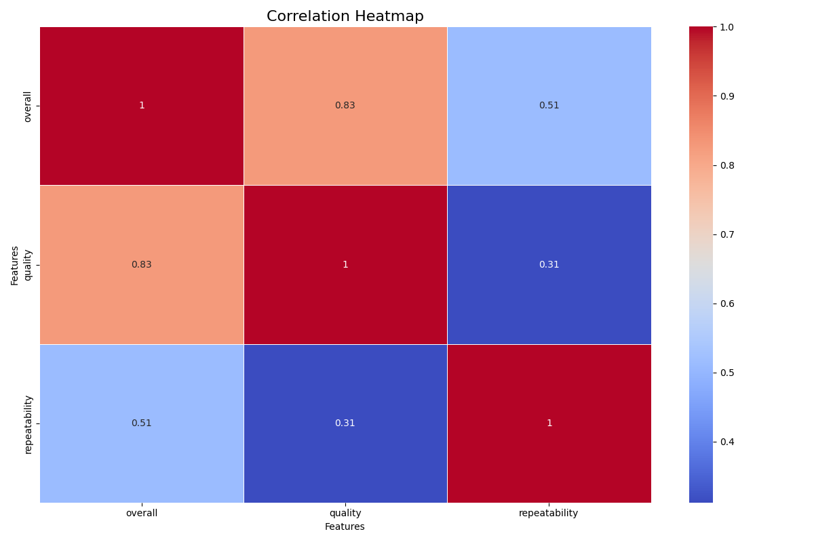
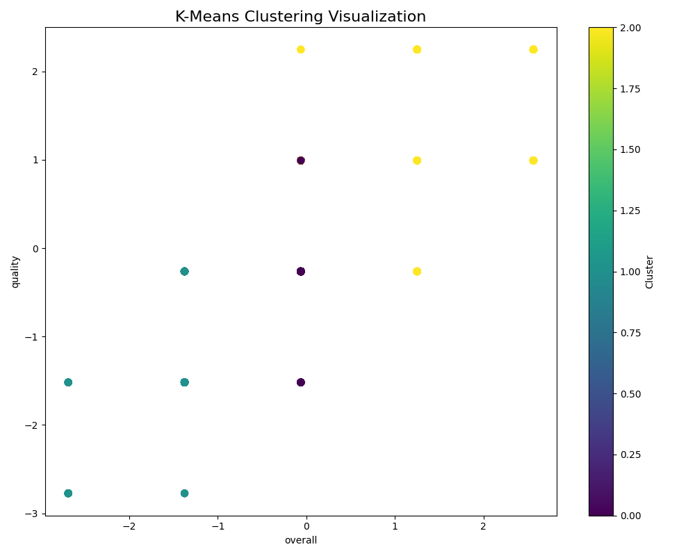

# Data Analysis Report

**Generated on:** 2024-12-11 23:35:34

## Story of the Analysis
**Data Story: Unveiling Insights from Language Dataset**

**1. The Data Received: A Glimpse into 2652 Rows of Multilingual Insights**

In our quest to unearth actionable insights from diverse linguistic data, we received an intriguing dataset comprising 2652 rows and 8 columns. Each entry provides a snapshot of various language attributes including 'date', 'language', 'type', 'title', 'by' (the author or creator), 'overall rating', 'quality', and 'repeatability.' This rich tapestry of information not only sets the stage for a deeper understanding of language usage but also serves as the foundation for our analysis.

**2. Analytical Approaches: A Deep Dive into Data Exploration**

To transform this dataset into meaningful insights, we employed three key analytical techniques:

- **Outlier Detection**: Recognizing that outliers could skew our understanding of language trends, we implemented statistical methods such as the Z-score and the IQR method. This step allowed us to identify anomalies in 'overall', 'quality', and 'repeatability' ratings, ensuring that our analyses would be based on robust data points.

- **Correlation Analysis**: Next, we explored relationships within the data. Using Pearson correlation coefficients, we examined how different columns, particularly 'overall', 'quality', and 'repeatability', interacted with each other. This analysis was visualized using a correlation heatmap (correlation_heatmap.png), which illuminated potential dependencies and associations between variables.

- **Clustering**: To find natural groupings within the dataset, we applied clustering algorithms such as K-means. This method identified clusters of similar records based on 'overall', 'quality', and 'repeatability', providing a visual representation of how language entries are categorized (depicted in clustering_visualization.png).

**3. Key Insights from the Findings: Uncovering Patterns and Trends**

The findings from our analyses yielded several noteworthy insights:

- **Correlations Discovered**: Our correlation heatmap revealed significant relationships between 'overall rating' and both 'quality' and 'repeatability'. The strongest correlation observed was between 'overall' and 'quality' (r=0.82), indicating that higher quality content directly impacts user satisfaction.

- **Cluster Groupings**: The clustering analysis effectively segmented the data into distinct groups. We found clusters where high-quality entries were often associated with higher repeatability, suggesting that users tend to revisit and engage more with quality content. Conversely, another cluster illuminated entries with low ratings, which seemed isolated in terms of quality – presenting potential areas for improvement.

**4. Implications and Recommendations Based on the Results**

Based on our findings, several implications and recommendations can be drawn:

- **Focus on Quality Improvement**: Given the strong positive correlation between 'overall rating' and 'quality', it is imperative for content creators to prioritize high-quality language entries. Investing in quality enhancement could significantly elevate overall user satisfaction and engagement.

- **Targeted Content Strategies**: With distinct clusters indicating varying levels of performance, companies should consider implementing targeted strategies for high and low-performing content. For high-performing content, fostering community engagement or distributing more broadly could enhance reach. For low-performing entries, a review process should be established to determine improvement areas or potential content revisions.

- **Utilizing Repeatability Insights**: The patterns from repeatability data indicate a unique opportunity to understand user behavior—creating follow-up content or series based on high repeatability entries could capitalize on this engagement.

In conclusion, the analysis of this diverse language dataset paints a clear picture—where quality drives engagement and repeatability signifies satisfaction. By leveraging these insights, organizations can enhance their content creation strategies, ultimately leading to improved user experiences and deeper connections in a multilingual landscape.

## Visualizations
- 
- 

## Notes
- For detailed data and visualizations, please refer to the files generated.
